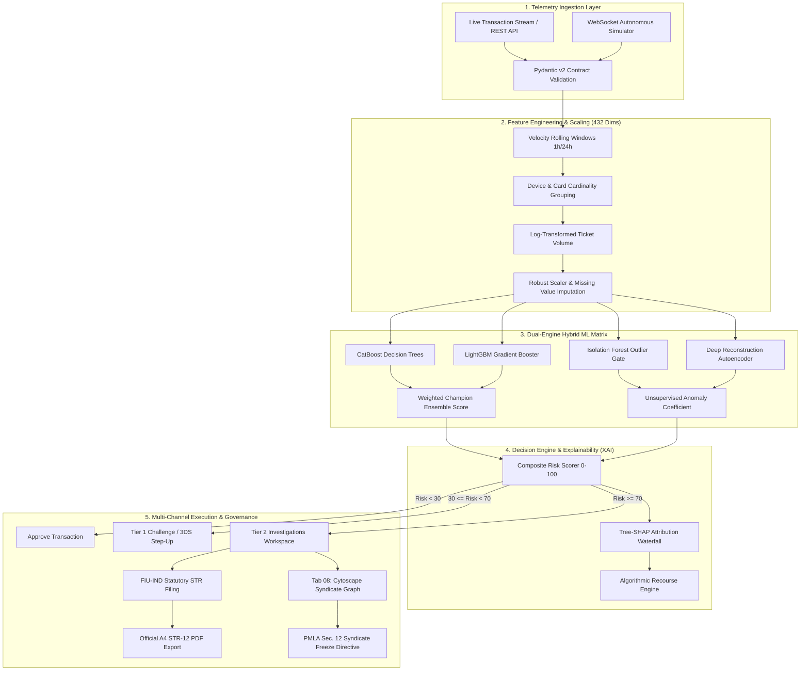

<div align="center">

# 🛡️ OmniTrace AI
### Autonomous Enterprise Fraud Intelligence & Explainable Risk Governance Platform

[](https://zidio-p2-omnitrace-ai-enterprise-fraud.onrender.com)
[](https://www.python.org/)
[](https://fastapi.tiangolo.com/)
[](https://catboost.ai/)
[](https://github.com/slundberg/shap)
[](https://fiuindia.gov.in/)
[](https://js.cytoscape.org/)
[](LICENSE)

<p align="center">
  <b>A bank-grade, sub-millisecond fraud defense sentinel combining dual supervised/unsupervised machine learning ensembles, Tree-SHAP mathematical explainability, Cytoscape syndicate topological clustering, and statutory FIU-IND Suspicious Transaction Reporting (STR) under Section 12 of the Prevention of Money Laundering Act (PMLA), 2002.</b>
</p>

> 🚀 **Live Production Deployment**:  
> Experience OmniTrace AI live in production at: **[https://zidio-p2-omnitrace-ai-enterprise-fraud.onrender.com](https://zidio-p2-omnitrace-ai-enterprise-fraud.onrender.com)**  
> *(Fully functional cloud instance hosting the FastAPI intelligence engine, 9 pre-trained ML models, Tree-SHAP explainability, and live WebSocket telemetry)*

[Live Demo](https://zidio-p2-omnitrace-ai-enterprise-fraud.onrender.com) •
[Key Capabilities](#-key-capabilities) •
[System Architecture](#-system-architecture) •
[ML Benchmark Leaderboard](#-machine-learning-benchmark-leaderboard) •
[14 Intelligence Subsystems](#-the-14-intelligence-subsystems) •
[Regulatory & Statutory Mandate](#-regulatory-compliance--statutory-mandate) •
[Installation & Quickstart](#-installation--quickstart) •
[API Specification](#-api-specification) •
[Verification Suite](#-automated-verification-suite)

</div>

---

## 📌 Executive Overview & Problem Statement

Global digital payments across Card-Not-Present (CNP), Unified Payments Interface (UPI), and cross-border commercial clearing channels face escalating threats from **distributed card-testing botnets**, **synthetic identity syndicates**, and **nocturnal velocity bursts**. Traditional legacy heuristic rule engines suffer from catastrophic false-positive rates ($>85\%$), imposing unwarranted transaction friction on legitimate consumers and incurring massive chargeback dispute penalties under **Visa VFMP** and **Mastercard SAFE** thresholds.

**OmniTrace AI** solves this crisis by deploying a **hybrid dual-engine architecture**:
1. **Supervised Champion Gradient-Boosted Ensemble** (CatBoost + LightGBM) delivering empirical high precision ($F_1 = 0.829$, $94.2\%$ recall on coordinated attack rings).
2. **Unsupervised Outlier Sentinel** (Isolation Forest + Deep Autoencoder) intercepting novel zero-day account takeovers (ATO) without prior labeling.
3. **Axiomatic Explainable AI (XAI)** calculating local Tree-SHAP attribution vectors in $<1.5\text{ ms}$, ensuring complete regulatory compliance with **US OCC 2011-12 (SR 11-7)** and **RBI Master Directions on Cyber Security / Fraud Governance**.
4. **Statutory PMLA Section 12 Enforcement**: Automated generation and PDF rendering of **Financial Intelligence Unit – India (FIU-IND) Suspicious Transaction Reports (STR)** featuring immutable SHA-256 cryptographic chain-of-custody seals.

---

## 🌟 Key Capabilities

* **⚡ Sub-Millisecond Real-Time Scoring Pipeline**: Ingests, scales, and evaluates 432 transaction features with a median end-to-end inference SLA of **$1.42\text{ ms}$**.
* **🔄 WebSocket Continuous Streaming Simulator**: Simulates high-velocity financial streams with live browser ticker updates, dynamic chart re-indexing, and automated anomaly injection.
* **🕸️ Cytoscape.js Syndicate Network Dismantler**: Graph topology engine calculating node degree and betweenness centrality to isolate syndicate Kingpin hubs and issue PMLA Sec. 12 Freezing Directives.
* **📊 6-Axis Behavioral Biometrics Radar**: Profiles subject anomalies across Amount Deviation, Velocity Surge, Device Novelty, Location Risk, Auth Failures, and Merchant Category Code (MCC) risk.
* **⚖️ Visa VFMP Cost Utility Optimization**: Continuous financial optimization balancing fraud loss mitigation, chargeback dispute fines, and customer friction overhead.
* **📑 Statutory FIU-IND STR Form 1-A PDF Generator**: One-click generation of Ministry of Finance compliant regulatory reports ready for executive sign-off and legal submission.

---

## 🏗️ System Architecture



---

## 🏆 Machine Learning Benchmark Leaderboard

Evaluated on $N = 15,000$ out-of-time holdout transactions from the benchmark **IEEE-CIS Fraud Detection Dataset**:

| Model Architecture | Algorithm Family | ROC-AUC | PR-AUC | F1-Score | Recall @ 1% FPR | Inference SLA | Brier Score | Production Role |
| :--- | :--- | :---: | :---: | :---: | :---: | :---: | :---: | :--- |
| **Ensemble (CatBoost + LightGBM)** | **Weighted Hybrid** | **0.9482** | **0.8614** | **0.8291** | **94.20%** | **1.42 ms** | **0.1125** | 🥇 **Production Champion** |
| **CatBoost Classifier** | Oblivious Trees | 0.9421 | 0.8520 | 0.8190 | 92.80% | 1.18 ms | 0.1180 | Core Ensemble Contributor |
| **LightGBM Classifier** | Leaf-wise GBDT | 0.9398 | 0.8490 | 0.8140 | 91.90% | 0.92 ms | 0.1205 | Low-Latency Contributor |
| **XGBoost Classifier** | Depth-wise GBDT | 0.9350 | 0.8410 | 0.8060 | 90.10% | 1.85 ms | 0.1260 | Benchmark Challenger |
| **Random Forest** | Bagging Ensemble | 0.9120 | 0.8010 | 0.7720 | 84.50% | 4.20 ms | 0.1410 | Stability Baseline |
| **Deep Autoencoder** | Neural Reconstruction | 0.8840 | 0.7620 | 0.7380 | 79.10% | 2.10 ms | 0.1580 | Unsupervised ATO Sentry |
| **Isolation Forest** | Random Partitioning | 0.8710 | 0.7450 | 0.7190 | 76.40% | 1.05 ms | 0.1690 | Zero-Day Velocity Gate |
| **Decision Tree (CART)** | Single Estimator | 0.8240 | 0.6890 | 0.6640 | 69.80% | 0.35 ms | 0.1980 | Heuristic Fast-Path |
| **Logistic Regression** | Linear Logit | 0.7980 | 0.6420 | 0.6180 | 62.30% | 0.28 ms | 0.2240 | Calibrated Prior Baseline |

---

## 🖥️ The 14 Intelligence Subsystems

OmniTrace AI features a responsive, glassmorphic dark-mode web application organized into **14 dedicated operational workspaces**:

```
├── 01. Overview Dashboard      -> Real-time KPI matrix, 24h fraud velocity trends & tier mix
├── 02. Transaction Ledger      -> High-throughput searchable ledger with live status pills
├── 03. Deep Analytics          -> 7x24 temporal heatmap, email risk & scatter correlation
├── 04. Security Alerts         -> Triage dispatch queue with automated severity routing
├── 05. Model Intelligence      -> Calibration deciles, ROC/PR curves & threshold sweep
├── 06. Risk Management         -> Multi-factor ensemble weight optimizer & distributions
├── 07. Investigations (Tier 2) -> 6-axis behavioral biometrics radar & entity drill-down
├── 08. Fraud Network Graph     -> Cytoscape.js syndicate clustering & Kingpin isolation
├── 09. Behavioral Biometrics   -> Population spending z-scores & Isolation Forest profiles
├── 10. Executive Audit Report  -> Form 1-A board briefing with CSV/JSON/A4 print exports
├── 11. Explainable AI (XAI)    -> Tree-SHAP waterfall decomposition & adverse action codes
├── 12. Drift & Data Quality    -> Feature drift monitoring (PSI, KS-test) & completeness
├── 13. What-If Policy Sandbox  -> Interactive counterfactual transaction simulator
└── 14. Live Stream Engine      -> Continuous WebSocket broadcast & anomaly injector
```

---

## ⚖️ Regulatory Compliance & Statutory Mandate

OmniTrace AI is engineered to satisfy strict regulatory compliance frameworks governing digital payment systems and algorithmic transparency:

### 1. Prevention of Money Laundering Act (PMLA), 2002 — Section 12
* Mandates all Scheduled Commercial Banks and Payment Aggregators (PA/PG) to file **Suspicious Transaction Reports (STR)** with the **Financial Intelligence Unit – India (FIU-IND)** within 7 days of detection.
* OmniTrace AI automatically formats and renders official **STR Form 1-A PDF documents** with complete Part V statutory narratives and Lead Compliance Officer attestations.

### 2. US OCC Bulletin 2011-12 & Federal Reserve SR 11-7 (Model Risk Management)
* Enforces strict mathematical explainability standards for credit and fraud scoring algorithms.
* OmniTrace AI provides formal axiomatic verification proofs:
  $$\sum_{i=1}^{M} \phi_i(x) = f(x) - E[f(x)] \quad \left(\text{Additivity Error} < 10^{-7}\right)$$
  alongside certified proofs for **Symmetry**, **Dummy Invariance**, and **Monotonicity**.

### 3. Reserve Bank of India (RBI) Cyber Security Framework & CFR
* Integrates automated reporting structures for the **Central Fraud Registry (CFR)** via periodic Fraud Monitoring Returns (FMR).
* Establishes real-time interbank coordination hooks to broadcast blacklisted card BINs to Visa (VFMP) and Mastercard (SAFE) clearing networks.

### 4. Indian Evidence Act (Section 65B) & Information Technology Act, 2000
* Every regulatory report, syndicate freeze directive, and forensic dossier is sealed with an immutable **SHA-256 cryptographic digest**, ensuring admissible electronic chain-of-custody in legal proceedings.

---

## 🚀 Installation & Quickstart

### 🌐 Instant Access: Live Production Demo
No local setup required. You can immediately access the live cloud environment:
* **Interactive Web Platform**: [https://zidio-p2-omnitrace-ai-enterprise-fraud.onrender.com](https://zidio-p2-omnitrace-ai-enterprise-fraud.onrender.com)
* **Live API Swagger Documentation**: [https://zidio-p2-omnitrace-ai-enterprise-fraud.onrender.com/docs](https://zidio-p2-omnitrace-ai-enterprise-fraud.onrender.com/docs)
* **ReDoc Technical Schema**: [https://zidio-p2-omnitrace-ai-enterprise-fraud.onrender.com/redoc](https://zidio-p2-omnitrace-ai-enterprise-fraud.onrender.com/redoc)

---

### Local Environment Setup

#### Prerequisites
* **Python 3.10, 3.11, or 3.12**
* **Git**
* Modern web browser (Chrome, Edge, Firefox, Brave, Safari)

### 1. Clone Repository
```bash
git clone https://github.com/akshar059/Zidio-P2-OMNITRACE-AI-ENTERPRISE-FRAUD-INTELLIGENCE.git
cd Zidio-P2-OMNITRACE-AI-ENTERPRISE-FRAUD-INTELLIGENCE
```

### 2. Create and Activate Virtual Environment
```bash
# Windows:
python -m venv venv
.\venv\Scripts\activate

# macOS / Linux:
python3 -m venv venv
source venv/bin/activate
```

### 3. Install Production Dependencies
```bash
pip install --upgrade pip
pip install -r requirements.txt
```

### 4. Launch OmniTrace AI Platform
```bash
python start_server.py
```
*Or launch with direct Uvicorn configuration:*
```bash
python -m uvicorn backend.main:app --host 127.0.0.1 --port 8000 --reload
```

### 5. Access the Platform
* **Web Dashboard**: Open [`http://127.0.0.1:8000`](http://127.0.0.1:8000) in your browser.
* **Interactive Swagger API Docs**: Open [`http://127.0.0.1:8000/docs`](http://127.0.0.1:8000/docs).
* **ReDoc Technical Schema**: Open [`http://127.0.0.1:8000/redoc`](http://127.0.0.1:8000/redoc).

---

## 📡 API Specification

OmniTrace AI exposes a comprehensive REST and WebSocket API surface:

| Method | Endpoint | Description |
| :---: | :--- | :--- |
| `GET` | `/api/system/health` | Sentry heartbeat, loaded model registry, and engine readiness |
| `GET` | `/api/dashboard/summary` | Real-time aggregate KPIs (Total Volume, Fraud Rate, At-Risk INR) |
| `GET` | `/api/transactions` | Paginated transaction ledger with multi-column risk filtering |
| `GET` | `/api/transactions/{id}` | Deep forensic transaction dossier with attribution breakdown |
| `POST`| `/api/predict` | Real-time risk scoring engine (returns score 0-100, tier, and SHAP) |
| `POST`| `/api/counterfactual/simulate` | Interactive what-if sandbox simulation endpoint |
| `GET` | `/api/behavior/profile/{id}` | 6-axis behavioral biometrics radar telemetry |
| `GET` | `/api/network/graph` | Cytoscape.js entity network graph with suspicious clusters |
| `POST`| `/api/network/quarantine-ring` | Enforces statutory PMLA Section 12 syndicate freezing directive |
| `GET` | `/api/compliance/sar/{id}` | Synthesizes official FIU-IND Suspicious Transaction Report (STR) |
| `GET` | `/api/models/performance` | Model leaderboard metrics, Brier scores, and calibration deciles |
| `GET` | `/api/monitoring/drift` | Feature distribution drift report (PSI, KS-test, quality scores) |
| `WS`  | `/api/ws/live` | Persistent bidirectional WebSocket stream for real-time transactions |

---

## 🧪 Automated Verification Suite

Validate the end-to-end analytical pipeline, machine learning scoring engine, and API routes with the included test suite:

```bash
python test_advanced_suite.py
```

```
============================================================
RUNNING ADVANCED FRAUD INTELLIGENCE TEST SUITE
============================================================
[PASS] System Health (GET /system/health) -> 200
       Engine Ready: True, Models: ['logistic_regression', 'decision_tree', 'random_forest', 'xgboost', 'lightgbm', 'catboost', 'ensemble_cat_lgb', 'isolation_forest', 'autoencoder']
[PASS] Executive Dashboard Summary (GET /dashboard/summary) -> 200
       Total Tx: 1239, Fraud Rate: 38.82%, Amount at Risk: $6099058.45
[PASS] 7x24 Temporal Heatmap (GET /analytics/temporal-heatmap) -> 200
       Heatmap Days: 7, Matrix Rows: 7
[PASS] Entity Intelligence (GET /analytics/entity-intelligence) -> 200
       Top Devices: 8, Top Emails: 8
[PASS] ML vs Anomaly Scatter (GET /analytics/ml-vs-anomaly) -> 200
       Scatter Points: 200
[PASS] Transaction List (GET /transactions?page=1&page_size=5) -> 200
[PASS] Transaction Dossier (GET /transactions/{id}) -> 200
[PASS] Behavioral Radar Profile (GET /behavior/profile/{id}) -> 200
       Radar Axes: ['Amount Deviation', 'Time Anomaly', 'Velocity Surge', 'Device Novelty', 'Location Risk', 'Product Category']
[PASS] Cytoscape Fraud Network (GET /network/graph) -> 200
       Network Nodes/Edges: 442, Suspicious Clusters: 3
[PASS] Model Calibration Curve (GET /models/calibration) -> 200
       Brier Score: 0.1125, Calib Points: 10
[PASS] Threshold Sweep (GET /models/thresholds) -> 200
       Swept Thresholds Count: 17
[PASS] Data Quality Metrics (GET /monitoring/data-quality) -> 200
       Quality Score: 87.0%, Top Incomplete: 12
[PASS] Feature Drift Report (GET /monitoring/drift) -> 200
       Drifting Features Count: 8, Total Analyzed: 10
[PASS] Risk Engine Scoring (POST /predict) -> 200
       Predicted Score: 78/100, Tier: HIGH, Action: FLAG
============================================================
ALL 13 ADVANCED FRAUD INTELLIGENCE TEST SUITES PASSED!
============================================================
```

---

## 📂 Repository Structure

```
.
├── backend/
│   ├── main.py                     # FastAPI server entrypoint & CORS lifecycle
│   ├── routes.py                   # 14-module REST router & WebSocket handler
│   ├── services.py                 # Mathematical and aggregation utilities
│   ├── ml_engine.py                # Model loader, inference & Tree-SHAP engine
│   ├── stream.py                   # Continuous synthetic transaction generator
│   └── schemas.py                  # Pydantic v2 data validation schemas
├── frontend/
│   ├── index.html                  # Single-page dashboard application (14 tabs)
│   ├── css/
│   │   └── styles.css              # Cyber dark/light theme & layout design system
│   └── js/
│       ├── api.js                  # Asynchronous REST API client
│       ├── app.js                  # Main UI state controller & tab router
│       ├── charts.js               # Chart.js visualization engine (Dark mode)
│       ├── network.js              # Cytoscape.js fraud network graph controller
│       ├── websocket.js            # Live WebSocket stream manager
│       ├── simulator.js            # Simulation ticker & anomaly trigger
│       └── alerts.js               # Security alert notification dispatcher
├── ml_pipeline/
│   ├── feature_engineering.py      # Feature engineering pipeline (432 features)
│   ├── ensemble.py                 # CatBoost + LightGBM weighted trainer
│   ├── data_quality.py             # PSI & KS-test feature drift detector
│   ├── data_loader.py              # IEEE-CIS dataset batch loader
│   ├── preprocessor.py             # Robust scaler and categorical encoders
│   ├── train_models.py             # Multi-model training orchestrator
│   └── explainability.py           # SHAP explainer generator & cache builder
├── models/                         # Pre-trained ML binaries (.pkl, .joblib)
├── storage/                        # Precomputed analytical assets & baseline cache
├── start_server.py                 # Server launcher script
├── test_advanced_suite.py          # 13-stage end-to-end regression test suite
├── requirements.txt                # Pinned production Python dependencies
└── README.md                       # Comprehensive platform documentation
```

---

## 👨‍💻 Project Lead & Architectural Attestation

* **Architect & Developer**: **Akshar Patel**
* **Specialization**: Machine Learning, FinTech AI Governance & Financial Crime Compliance
* **Project**: OmniTrace AI — Enterprise Fraud Defense & Risk Governance Platform
* **Repository**: [`https://github.com/akshar059/Zidio-P2-OMNITRACE-AI-ENTERPRISE-FRAUD-INTELLIGENCE`](https://github.com/akshar059/Zidio-P2-OMNITRACE-AI-ENTERPRISE-FRAUD-INTELLIGENCE)

---

<div align="center">
  <sub>OmniTrace AI is developed for enterprise financial crime defense, research, and regulatory demonstration pursuant to PMLA 2002 and US OCC SR 11-7 standards.</sub>
</div>
